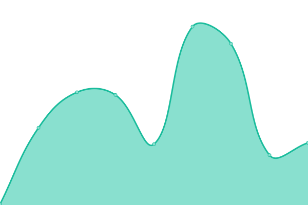
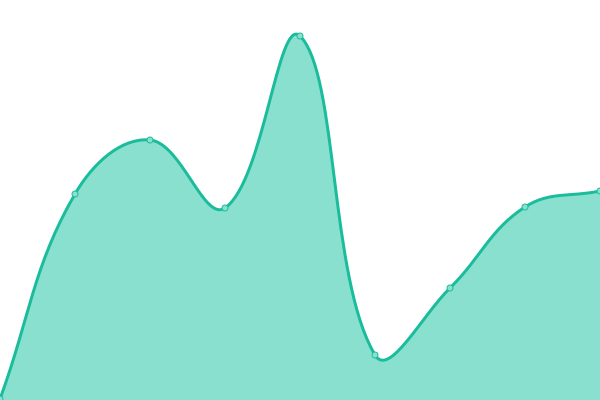
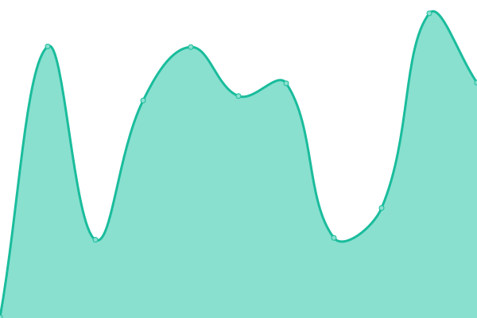

# [📈 Live Status](https://demo.upptime.js.org): <!--live status--> **🟧 Partial outage**

This repository contains the open-source uptime monitor and status page for [Upptime](https://upptime.js.org), powered by [Upptime](https://github.com/upptime/upptime).

With [Upptime](https://upptime.js.org), you can get your own unlimited and free uptime monitor and status page, powered entirely by a GitHub repository. We use [Issues](https://github.com/upptime/upptime/issues) as incident reports, [Actions](https://github.com/upptime/upptime/actions) as uptime monitors, and [Pages](https://demo.upptime.js.org) for the status page.

<!--start: status pages-->
<!-- This summary is generated by Upptime (https://github.com/upptime/upptime) -->
<!-- Do not edit this manually, your changes will be overwritten -->
<!-- prettier-ignore -->
| URL | Status | History | Response Time | Uptime |
| --- | ------ | ------- | ------------- | ------ |
|  [blog.aidengrong.top](https://blog.aidengrong.top) | 🟥 Down | [blog-aidengrong-top.yml](https://github.com/xfxx2022/upptime/commits/HEAD/history/blog-aidengrong-top.yml) | 

 0ms
     
 | 

<a href="https://demo.upptime.js.org/history/blog-aidengrong-top">100.00%</a>
    

|  [pan.aidengrong.top](https://pan.aidengrong.top) | 🟩 Up | [pan-aidengrong-top.yml](https://github.com/xfxx2022/upptime/commits/HEAD/history/pan-aidengrong-top.yml) | 

 1470ms
     
 | 

<a href="https://demo.upptime.js.org/history/pan-aidengrong-top">100.00%</a>
    

|  [chat.aidengrong.top](https://chat.aidengrong.top) | 🟩 Up | [chat-aidengrong-top.yml](https://github.com/xfxx2022/upptime/commits/HEAD/history/chat-aidengrong-top.yml) | 

 1264ms
     
 | 

<a href="https://demo.upptime.js.org/history/chat-aidengrong-top">100.00%</a>
    

|  [chat2.aidengrong.top](https://chat2.aidengrong.top) | 🟥 Down | [chat2-aidengrong-top.yml](https://github.com/xfxx2022/upptime/commits/HEAD/history/chat2-aidengrong-top.yml) | 

 0ms
     
 | 

<a href="https://demo.upptime.js.org/history/chat2-aidengrong-top">100.00%</a>
    

|  [chat3.aidengrong.top](https://chat3.aidengrong.top) | 🟥 Down | [chat3-aidengrong-top.yml](https://github.com/xfxx2022/upptime/commits/HEAD/history/chat3-aidengrong-top.yml) | 

 0ms
     
 | 

<a href="https://demo.upptime.js.org/history/chat3-aidengrong-top">100.00%</a>
    

|  [chat4.aidengrong.top](https://chat4.aidengrong.top) | 🟥 Down | [chat4-aidengrong-top.yml](https://github.com/xfxx2022/upptime/commits/HEAD/history/chat4-aidengrong-top.yml) | 

 0ms
     
 | 

<a href="https://demo.upptime.js.org/history/chat4-aidengrong-top">100.00%</a>
    

|  [img.aidengrong.top](https://img.aidengrong.top) | 🟩 Up | [img-aidengrong-top.yml](https://github.com/xfxx2022/upptime/commits/HEAD/history/img-aidengrong-top.yml) | 

 1310ms
     
 | 

<a href="https://demo.upptime.js.org/history/img-aidengrong-top">100.00%</a>
    

|  [web.aidengrong.top](https://web.aidengrong.top) | 🟩 Up | [web-aidengrong-top.yml](https://github.com/xfxx2022/upptime/commits/HEAD/history/web-aidengrong-top.yml) | 

 776ms
     
 | 

<a href="https://demo.upptime.js.org/history/web-aidengrong-top">100.00%</a>
    

|  [analytics.aidengrong.top](https://analytics.aidengrong.top) | 🟥 Down | [analytics-aidengrong-top.yml](https://github.com/xfxx2022/upptime/commits/HEAD/history/analytics-aidengrong-top.yml) | 

 0ms
     
 | 

<a href="https://demo.upptime.js.org/history/analytics-aidengrong-top">100.00%</a>
    

|  [wallpaper.aidengrong.top](https://wallpaper.aidengrong.top) | 🟩 Up | [wallpaper-aidengrong-top.yml](https://github.com/xfxx2022/upptime/commits/HEAD/history/wallpaper-aidengrong-top.yml) | 

 576ms
     
 | 

<a href="https://demo.upptime.js.org/history/wallpaper-aidengrong-top">100.00%</a>
    

|  [qiandao.aidengrong.top](https://qiandao.aidengrong.top) | 🟥 Down | [qiandao-aidengrong-top.yml](https://github.com/xfxx2022/upptime/commits/HEAD/history/qiandao-aidengrong-top.yml) | 

 0ms
     
 | 

<a href="https://demo.upptime.js.org/history/qiandao-aidengrong-top">100.00%</a>
    

|  [a.1314151.xyz](https://a.1314151.xyz) | 🟩 Up | [a-1314151-xyz.yml](https://github.com/xfxx2022/upptime/commits/HEAD/history/a-1314151-xyz.yml) | 

 423ms
     
 | 

<a href="https://demo.upptime.js.org/history/a-1314151-xyz">100.00%</a>
    

|  [b.1314151.xyz](https://b.1314151.xyz) | 🟩 Up | [b-1314151-xyz.yml](https://github.com/xfxx2022/upptime/commits/HEAD/history/b-1314151-xyz.yml) | 

 422ms
     
 | 

<a href="https://demo.upptime.js.org/history/b-1314151-xyz">100.00%</a>
    

|  [glitch搭建的xray](https://xray-glitch.deno.dev) | 🟩 Up | [glitch-xray.yml](https://github.com/xfxx2022/upptime/commits/HEAD/history/glitch-xray.yml) | 

 211ms
     
 | 

<a href="https://demo.upptime.js.org/history/glitch-xray">100.00%</a>
    

|  [Google](https://www.google.com) | 🟩 Up | [google.yml](https://github.com/xfxx2022/upptime/commits/HEAD/history/google.yml) | 

 89ms
     
 | 

<a href="https://demo.upptime.js.org/history/google">100.00%</a>
    

|  [Wikipedia](https://en.wikipedia.org) | 🟩 Up | [wikipedia.yml](https://github.com/xfxx2022/upptime/commits/HEAD/history/wikipedia.yml) | 

 316ms
     
 | 

<a href="https://demo.upptime.js.org/history/wikipedia">100.00%</a>
    

|  [Hacker News](https://news.ycombinator.com) | 🟩 Up | [hacker-news.yml](https://github.com/xfxx2022/upptime/commits/HEAD/history/hacker-news.yml) | 

 284ms
     
 | 

<a href="https://demo.upptime.js.org/history/hacker-news">100.00%</a>
    

|  [Test Broken Site](https://thissitedoesnotexist.koj.co) | 🟥 Down | [test-broken-site.yml](https://github.com/xfxx2022/upptime/commits/HEAD/history/test-broken-site.yml) | 

 0ms
     
 | 

<a href="https://demo.upptime.js.org/history/test-broken-site">100.00%</a>
    

<!--end: status pages-->

[**Visit our status website →**](https://demo.upptime.js.org)

## 📄 License

- Powered by: [Upptime](https://github.com/upptime/upptime)
- Code: [MIT](./LICENSE) © [Anand Chowdhary](https://anandchowdhary.com), supported by [Pabio](https://pabio.com)
- Data in the `./history` directory: [Open Database License](https://opendatacommons.org/licenses/odbl/1-0/)
